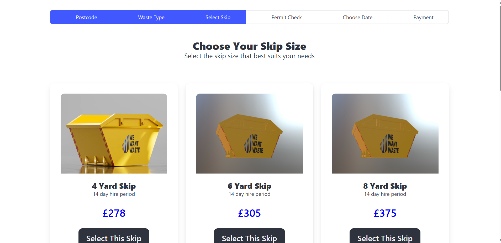
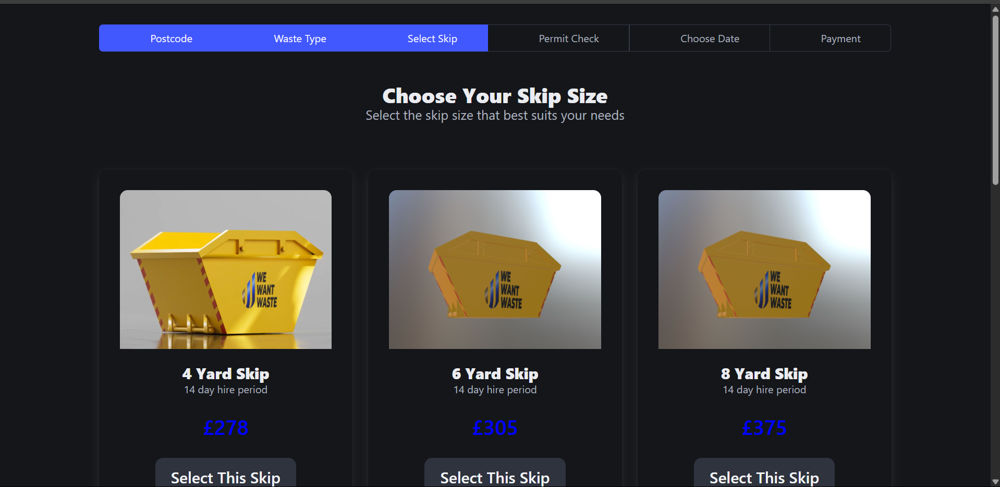
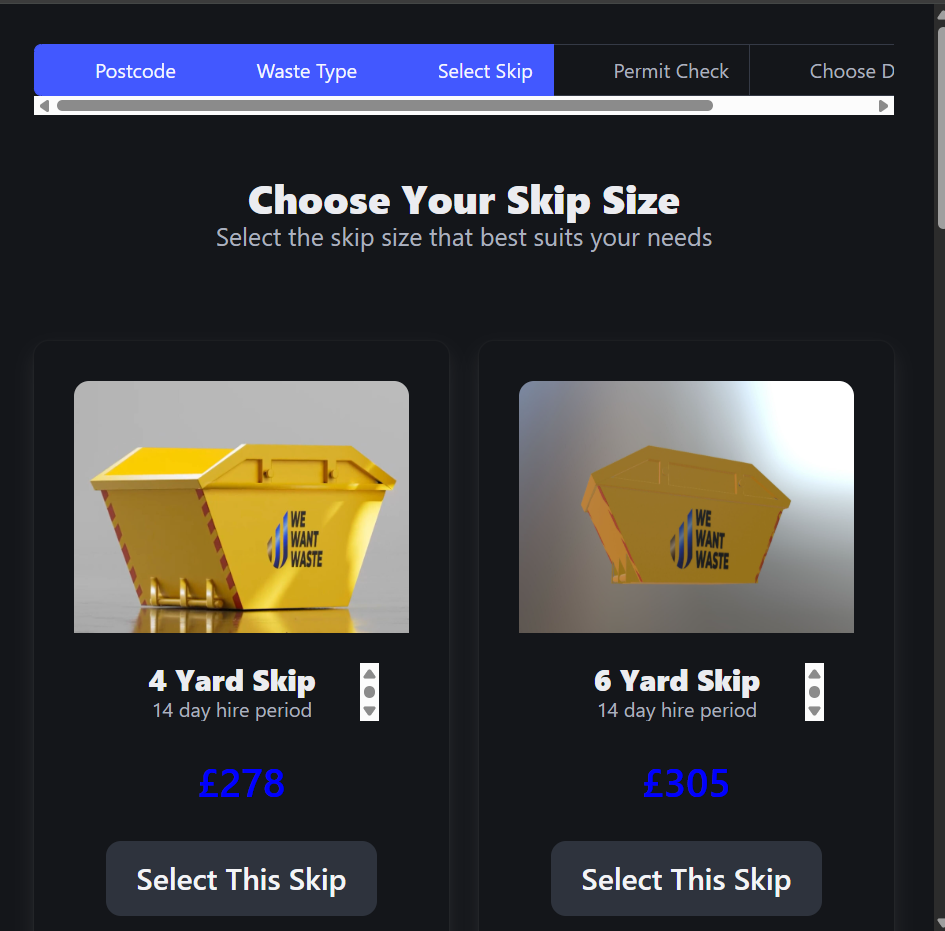

# Coding Challenge for RemWaste

Download the repository

And run 

npm run build 

then 

npm run dev 

Tools used :

Vite
React
Bulma 

Features :

Light mode :

Dark mode :

Responsive Mid:

Mobile : 
public/mobile.png

Mobile :

This project was build by me Heisler Stlano

Feel free to contribute
    
